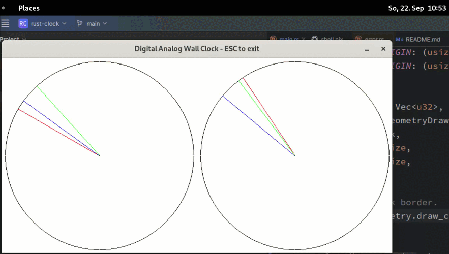

# Rust Clock - Digital Analog Wall Clock

This is a very basic example to show how `sin` and `cos` are used to calculate 
the coordinates of the hour, minute, and second indicators of an analog wall 
clock to create a digital representation. See `lib.rs`.

The drawing itself is done by the libs `minifb` and `minifb_geometry`.

Simply use `cargo run` to run the example. You need the dependencies of
[`minifb`](https://crates.io/crates/minifb) in your system to run everything.

